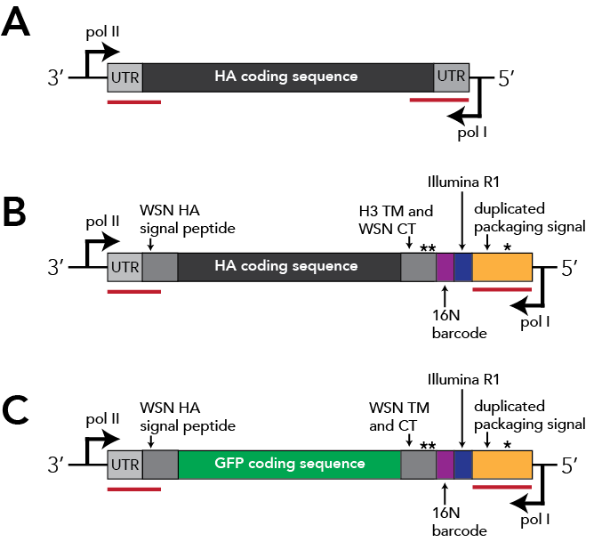

# Library design README
This subdirectory describes the creation of the H3N2 library, including details on the barcoded HA expression plasmid and the rationale for the strains chosen for the library. 

## Barcoded construct design
The barcoded construct used in these experiments is similar to that described in [Loes et al. 2024](https://www.ncbi.nlm.nih.gov/pmc/articles/PMC10942427/), but with a few modifications. See below figure and legend for details. 

(A) The unmodified HA expression construct, with packaging signals indicated by red underlines. 
(B) The modified chimeric H3 HA expression construct, with an upstream signal peptide fixed to WSN sequence,  downstream H3 transmembrane domain fixed to H3 consensus sequence, and C-terminal tail fixed to WSN sequence. As in the [Loes et al. 2024](https://www.ncbi.nlm.nih.gov/pmc/articles/PMC10942427/) H1 HA construct, there is a duplicated stop codon (indicated by "**") upstream of the 16-nucleotide barcode, which is followed by the Illumina R1 sequence and duplicated packaging signal. 
(C) The spike-in control RNA barcoded construct, which is identical to that described in [Loes et al. 2024](https://www.ncbi.nlm.nih.gov/pmc/articles/PMC10942427/).

## Choosing strains
I used several approaches to subselect pdmH1N1 and H3N2 strains for the HA variant libraries, keeping in mind an overall library size is limited to ~100 HA variants. 

The first of these is Nextstrain, a web-based tool that builds subsampled phylogenetic trees for multiple time frames (e.g., 6-month, 2-year, etc.). In addition to clade and subclade levels of influenza diversity, Nextstrain also defines *derived haplotypes*, which are strain groupings within subclades containing additional HA1 amino acid mutations that achieve a given threshold of descendent/children strains. I selected a single representative strain from each derived haplotype by choosing a strain closest to the node of the defined haplotype sequence. 

Additionally, I used Nextclade to identify high-frequency haplotypes that had not been defined as *derived haplotypes* by Nextstrain. 

I then fixed the upstream signal peptide of these sequences to WSN, the transmembrane domain to an H3 consensus, and the C-terminal tail to WSN as described in the above figure. These protein sequences are placed in [2023-2024_H3_library_protein_constructs.fasta](2023-2024_H3_library_protein_constructs.fasta). The trimmed HA1 sequences are placed in [2023-2024_H3_library_protein_HA1.fasta](2023-2024_H3_library_protein_HA1.fasta), and variable HA ectodomain sequences (with the H3 transmembrane domain removed) are placed in [2023-2024_H3_library_protein_HA_ectodomain.fasta](2023-2024_H3_library_protein_HA_ectodomain.fasta).