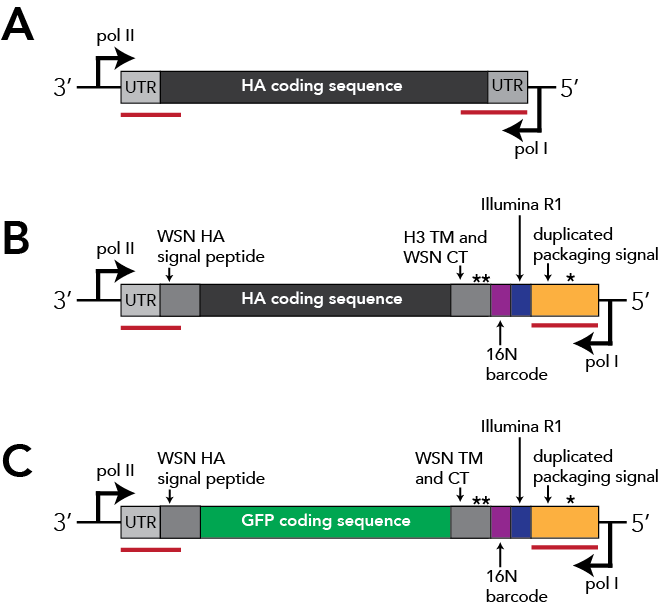

# Choosing H3N2 HA sequences for a `seqneut` library using Nextstrain and Nextclade methods
This subdirectory describes the creation of the 2023-2024 H3N2 library, including details on the barcoded HA expression plasmid and the rationale for the strains chosen for the library. 
Author: Caroline Kikawa

## Quick summary
This directory contains the analysis performed to select strains and the design of the barcoded HA constructs for the 2023-2024 H3N2 library. The most relevant steps are documented in interactive Jupyter Notebooks placed in [notebooks/](notebooks/):
* Picking strains using the Nextstrain trees and Nextclade datasets available in November 2023 [notebooks/compare_trees_design_library.ipynb](notebooks/compare_trees_design_library.ipynb)
* Designing the actual HA barcoded construct sequences [notebooks/design_H3_HAconstructs.ipynb](notebooks/design_H3_HAconstructs.ipynb)

The most relevant results (HA sequences, sequence IDs) are placed in [results/](results/), specifically:
* The trimmed HA1 sequences are placed in [results/2023-2024_H3_library_protein_HA1.fasta](results/2023-2024_H3_library_protein_HA1.fasta)
* The HA ectodomain sequences (with the H3 transmembrane domain removed) are placed in [results/2023-2024_H3_library_protein_HA_ectodomain.fasta](results/2023-2024_H3_library_protein_HA_ectodomain.fasta).
* The chimeric HA protein construct sequences with upstream signal peptide fixed to WSN sequence, downstream transmembrane domain fixed to H3 consensus, and downstream C-terminal tail fixed to WSN sequence are listed in [results/2023-2024_H3_library_protein_constructs.fasta](results/2023-2024_H3_library_protein_constructs.fasta)

The rest of this README contains the **overview (*section 1*)** and the details of **strain choice (*section 2*)** and **barcode design (*section 3*)** involved in designing a library for `seqneut` assays.

## 1. Library design overview
There were several approaches to subselect pdmH1N1 and H3N2 strains for the HA variant libraries, keeping in mind an overall library size is limited to ~100 HA variants. 

The first of these is [Nextstrain](https://nextstrain.org/), a web-based tool that builds subsampled phylogenetic trees for multiple time frames (e.g., 6-month, 2-year, etc.). In addition to clade and subclade levels of influenza diversity, Nextstrain also defines **derived haplotypes**, which are strain groupings within subclades containing additional HA1 amino acid mutations that achieve a given threshold of descendent/children strains. I selected a single representative strain from each derived haplotype by choosing a strain closest to the node of the defined haplotype sequence. The JSON format Nextstrain trees we used are placed in [data/nextstrain_trees/](data/nextstrain_trees/).

Additionally, [Nextclade](https://clades.nextstrain.org/) datasets can be used to identify high-frequency haplotypes that had not been defined as **derived haplotypes** by Nextstrain. 

I then fixed the upstream signal peptide of these sequences to WSN, the transmembrane domain to an H3 consensus, and the C-terminal tail to WSN (see **section 3** for more details). These protein sequences are listed above in the **Quick summary**.

## 2. Choosing strains -- the detailed approach
As stated above, we aimed to create a seasonal influenza viral variant library for sequencing-based neutralization assays, specifically for H3N2 subtype viruses within a 12-month period of November 2023. Therefore, the primary goal was to identify **representative circulating strains** at high density across clades and subclades (i.e., broad genetic groupings of seasonal influenza viruses). 

We identified all **derived haplotypes** on Nextstrain season-flu 6-month and 2-year builds available at the the time of library design. These trees are subsampled by time and geographic regions.
*  A `derived haplotype` is a Nextstrain-specific piece of jargon that is assigned to an HA1 haplotype (a subclade with additional amino acid mutations called on that background, for example, a J.2 virus with S145N mutation would be called 'J.2:S145N') that has achieved some threshold of child/descendent sequences over a specified timeline.

We also used Nextclade datasets available at the time, which are not subsampled. These Nextclade datasets allowed us to supplement our analysis in multiple ways:
* First, we needed the GISAID IDs for the strains we chose using the the Nextstrain trees. We do a simple string match of strain name (e.g., A/Darwin/9/2021) to find matching GISAID IDs.
* Second, we decided to add additional strains outside of the derived haplotypes defined by Nextstrain. We used a method that took haplotype record count into consideration. This analysis necessitated a non-subsampled dataset for absolute record counts.

### 2.1. Get derived haplotypes from Nextstrain 6-month and 2-year trees
This method uses a script written by John Huddleston in the Bedford lab, with edits from Andrea Loes and Caroline Kikawa in the Bloom lab, to identify H3 derived haploytypes.
Strains that represent these derived haplotype are chosen by selecting the strain with least divergence from determined derived haplotype node.
* Many of the next steps use [csvtk](https://bioinf.shenwei.me/csvtk/) which you can install with: 

        conda install -c conda-forge -c bioconda csvtk

* Alternatively, build and activate the `conda` virtual environment listed in [environments/nextstrain_environment.yml](environments/nextstrain_environment.yml) with:

        conda env create -f environments/nextstrain_environment.yml
        conda activate nextstrain_library_design

### 2.2. Download and process the Nexstrain 6-month and 2-year H3N2 HA trees.
First, download the trees. 
    
    curl --compressed -OL https://data.nextstrain.org/flu_seasonal_h3n2_ha_6m.json

Then use the following command(s) for the 6m tree:
* Extract relevant attributes from the tree JSON in a data frame, see [original gist](https://gist.github.com/huddlej/5d7bd023d3807c698bd18c706974f2db) for more details:

        python scripts/auspice_tree_to_table.py \
            --tree nextstrain_trees/flu_seasonal_h3n2_ha_6m.json \
            --output-metadata auspice_tables/flu_seasonal_h3n2_ha_6m.tsv \
            --attributes div num_date clade_membership subclade haplotype

* Select representative strain per haplotype with shortest branch length. Filter to samples collected in 2022 or after, sort by haplotype and cumulative divergence, and select the first record per haplotype. I ran the following command to get a per haplotype table:

        csvtk filter -t -f 'num_date>2022.0' auspice_tables/flu_seasonal_h3n2_ha_6m.tsv \
            | csvtk sort -t -k haplotype -k div:n \
            | csvtk uniq -t -f haplotype > auspice_haplotypes/representative_strains_per_haplotype_6m.tsv

Repeat the above commands for the 2y tree. Here are the commands I used:

    curl --compressed -OL https://data.nextstrain.org/flu_seasonal_h3n2_ha_6m.json

    python scripts/auspice_tree_to_table.py \
            --tree nextstrain_trees/flu_seasonal_h3n2_ha_2y.json \
            --output-metadata auspice_tables/flu_seasonal_h3n2_ha_2y.tsv \
            --attributes div num_date clade_membership subclade haplotype
    
    csvtk filter -t -f 'num_date>2022.0' auspice_tables/flu_seasonal_h3n2_ha_2y.tsv \
        | csvtk sort -t -k haplotype -k div:n \
        | csvtk uniq -t -f haplotype > auspice_haplotypes/representative_strains_per_haplotype_2y.tsv

### 2.3. Download and process Nextclade datasets
For the next steps, I needed a Nextclade metadata file [data/nextclade_metadata_h3n2_2023-11-21.tsv](data/nextclade_metadata_h3n2_2023-11-21.tsv) file from John Huddleston (Bedford lab), which 
I don't have permissions to create, and which John generated for me with the following commands: 

    aws s3 cp s3://nextstrain-data-private/files/workflows/seasonal-flu/h3n2/metadata.tsv.xz .
    aws s3 cp s3://nextstrain-data-private/files/workflows/seasonal-flu/h3n2/ha/sequences.fasta.xz .

Then, download the latest Nextclade dataset for H3N2 HA (A/Darwin/6/2021 reference):

    nextclade dataset get -n flu_h3n2_ha --output-dir nextclade_h3n2

To filter sequences and metadata to those collected in 2022 or after and exclude egg-passaged strains:

    augur filter \
        --sequences sequences.fasta.xz \
        --metadata metadata.tsv.xz \
        --min-date 2022 \
        --query "passage_category != 'egg'" \
        --output-sequences filtered_sequences.fasta.xz \
        --output-metadata filtered_metadata.tsv

Then, run Nextclade on the full dataset.

    nextclade run \
        -D nextclade_h3n2 filtered_sequences.fasta.xz \
        --quiet \
        --output-tsv nextclade_h3n2.tsv

Finally, we need to join Nextclade annotations and metadata. First, select columns we want from Nextclade, then extract HA1
substitutions, and join Nextclade data with metadata.
    
    csvtk cut -t -f seqName,short_clade,subclade,aaSubstitutions nextclade_h3n2.tsv \
            | csvtk mutate -t -f aaSubstitutions -n HA1_substitutions -p "^(HA1.*?),(HA2|Sig).*" \
            | csvtk join -t --fields "seqName;strain" /dev/stdin filtered_metadata.tsv \
            | csvtk cut -t -f -virus,-segment,-ha,-na,-is_reference > nextclade_metadata_h3n2_2023-11-21.tsv

Add a column with count of records per distinct HA1 haplotype, ignoring empty strings and ordering by count in descending order:

    csvtk summary -t -f seqName -g HA1_substitutions nextclade_metadata_h3n2_2023-11-21.tsv \
        | csvtk rename -t -f "seqName:count" -n "count" \
        | csvtk filter2 -t -f '${HA1_substitutions}!=""' \
        | csvtk sort -t -k count:rn > nextclade_haplotypes/nextclade_HA1_haplotype_counts.tsv

### 2.4. Get high frequency haplotypes from Nextclade dataset
Annotate NextClade table with HA1 haplotype counts, select a representative sample for each haplotype, and sort by haplotype count (to top N records or haplotypes with at least N samples)

    csvtk join -t -f HA1_substitutions nextclade_metadata_h3n2_2023-11-21.tsv nextclade_haplotypes/nextclade_HA1_haplotype_counts.tsv \
    | csvtk uniq -t -f HA1_substitutions \
    | csvtk sort -t -k count:rn \
    | csvtk rename -t -f "count" -n "HA1_haplotype_count" > nextclade_haplotypes/representative_strains_per_HA1_haplotype_nextclade.tsv

### 2.5. Run interactive Jupyter Notebook
First, build and activate the conda environment placed in [environments/library_environment.yaml](environments/library_environment.yaml) with:

    conda env create -f environments/library_environment.yaml
    conda activate library_design
    
Then, run the Jupyter Notebook [analyze_library_HA_sequences.ipynb](analyze_library_HA_sequences.ipynb) interactively to analyze all Nextstrain and Nextclade haplotypes together. 
That notebook is annotated with details on how we finalized the set of sequences included in the library. 

### 2.6. Output of strain choosing analysis
The final output of library design includes key files:
* The list of library strain GISAID IDs that can be directly copy-pasted into GISAID EpiFlu search function is placed in [data/library_accession_numbers.csv](data/library_accession_numbers.csv)
    * Actual GISIAD sequences are not tracked in this repository due to data sharing restrictions
* A table of strains, the method by which they were selected and associated information (GISAID ID, collection date, HA1 substitutions, haplotype counts, etc.) [results/auspice_and_newHAsubs_library_strains.csv](results/auspice_and_newHAsubs_library_strains.csv)

## 3. Barcoded construct design
The barcoded construct used in these experiments is similar to that described in [Loes et al (2024)](https://journals.asm.org/doi/10.1128/jvi.00689-24), but with a few modifications. See below figure and legend for details. 

(A) The unmodified HA expression construct, with packaging signals indicated by red underlines. 
(B) The modified chimeric H3 HA expression construct, with an upstream signal peptide fixed to WSN sequence,  downstream H3 transmembrane domain fixed to H3 consensus sequence, and C-terminal tail fixed to WSN sequence. As in the [Loes et al (2024)](https://journals.asm.org/doi/10.1128/jvi.00689-24) H1 HA construct, there is a duplicated stop codon (indicated by "**") upstream of the 16-nucleotide barcode, which is followed by the Illumina R1 sequence and duplicated packaging signal. 
(C) The spike-in control RNA barcoded construct, which is identical to that described in [Loes et al (2024)](https://journals.asm.org/doi/10.1128/jvi.00689-24).

### 3.1. Create barcoded construct sequences from HA alignments
First, align the HA sequences of interest. We used MAFFT and placed these alignments in [data/alignments/](data/alignments/). Activate the `library_design` conda environment with:

    conda activate library_design

Then, create the construct sequences by running the interactive Jupyter notebook placed in [notebooks/design_H3_HAconstructs.ipynb](notebooks/design_H3_HAconstructs.ipynb). 

### 3.2 Output of construct design
The final output of the above notebook are:
* A directory of [results/ordersheets/](results/ordersheets/) containing tables including columns `name` and `sequence` required for ordering constructs from Twist
* A table of library strains with columns `library_ID` (a short ID used in cloning), `plasmid` (the Bloom lab plasmid log name), `strain-name`, `epi` (a GISAID ID associated with each strain) and `expected_seq` (the HA construct sequences, minus the barcode) placed in [results/library_ID_sheet.csv](results/library_ID_sheet.csv)
* The actual HA library sequences in FASTA format:
    * The trimmed HA1 sequences are placed in [results/2023-2024_H3_library_protein_HA1.fasta](results/2023-2024_H3_library_protein_HA1.fasta)
    * The HA ectodomain sequences (with the H3 transmembrane domain removed) are placed in [results/2023-2024_H3_library_protein_HA_ectodomain.fasta](results/2023-2024_H3_library_protein_HA_ectodomain.fasta).
    * The chimeric HA protein construct sequences with upstream signal peptide fixed to WSN sequence, downstream transmembrane domain fixed to H3 consensus, and downstream C-terminal tail fixed to WSN sequence are listed in [results/2023-2024_H3_library_protein_constructs.fasta](results/2023-2024_H3_library_protein_constructs.fasta)
